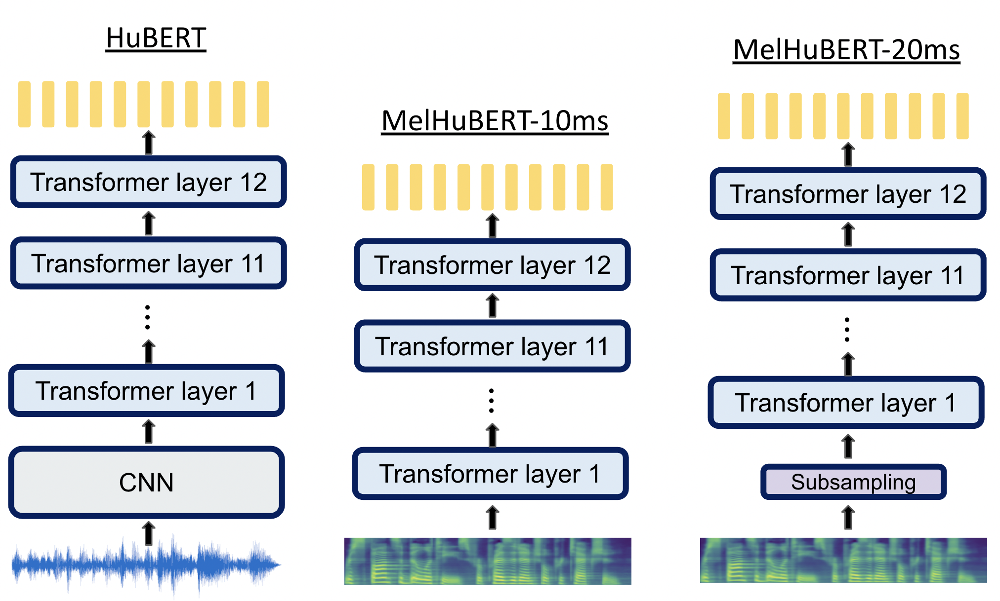








I am currently a first-year PhD student at National Taiwan University, in the Speech Processing Lab. 
My research interests include speech self-supervised models, model compression, and neuron analysis. 
I am eager to explore new research areas and am currently looking for research internships for the year 2025. 
If there are any possibilities for research collaboration, please feel free to contact me.

# 🔥 News
- *2024.06*: &nbsp;🎉🎉 Two papers (1 first author, 1 second author) accepted at Interspeech 2024. See you in Greece!

# 📝 Publications 

ASRU 2023

[MelHuBERT: A Simplified Hubert on Mel Spectrograms](https://ieeexplore.ieee.org/abstract/document/10389700)

**Tzu-Quan Lin**, Hung-Yi Lee, Hao Tang

[**Project**](https://github.com/nervjack2/MelHuBERT) <strong></strong>
- MelHuBERT simplifies the model architecture and loss function of HuBERT, achieving comparable performance while saving 33.5% of MACs per one second of speech.

- [Lorem ipsum dolor sit amet, consectetur adipiscing elit. Vivamus ornare aliquet ipsum, ac tempus justo dapibus sit amet](https://github.com), A, B, C, **CVPR 2020**

# 🎖 Honors and Awards
- *2021.10* Lorem ipsum dolor sit amet, consectetur adipiscing elit. Vivamus ornare aliquet ipsum, ac tempus justo dapibus sit amet. 
- *2021.09* Lorem ipsum dolor sit amet, consectetur adipiscing elit. Vivamus ornare aliquet ipsum, ac tempus justo dapibus sit amet. 

# 📖 Educations
- *2019.06 - 2022.04 (now)*, Lorem ipsum dolor sit amet, consectetur adipiscing elit. Vivamus ornare aliquet ipsum, ac tempus justo dapibus sit amet. 
- *2015.09 - 2019.06*, Lorem ipsum dolor sit amet, consectetur adipiscing elit. Vivamus ornare aliquet ipsum, ac tempus justo dapibus sit amet. 

# 💬 Invited Talks
- *2021.06*, Lorem ipsum dolor sit amet, consectetur adipiscing elit. Vivamus ornare aliquet ipsum, ac tempus justo dapibus sit amet. 
- *2021.03*, Lorem ipsum dolor sit amet, consectetur adipiscing elit. Vivamus ornare aliquet ipsum, ac tempus justo dapibus sit amet.  \| [\[video\]](https://github.com/)

# 💻 Internships
- *2019.05 - 2020.02*, [Lorem](https://github.com/), China.
